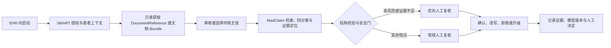

# MedClaim × FHIR/SMART｜只读临床文档审核概念图

版本：0.1
日期：2026-09-01

## 一句话定位

FHIR 定义医疗数据怎样表示和交换；SMART App Launch 定义应用怎样获得授权、从 EHR 启动并取得上下文；MedClaim 是位于其上的证据审核逻辑。当前项目只处理公开资料，下面是未来迁移到临床文档质量检查的概念设计，不是已部署功能。

## 概念工作流



设计停在人工决定和应用侧记录；没有 FHIR 写回、自动发布或诊疗建议。

## 最小资源映射

| 任务中的信息 | FHIR/SMART 概念 | 不能混淆的边界 |
|---|---|---|
| EHR 地址与一次启动 | `iss`、`launch` | `launch` 是不透明上下文标识，不是访问令牌 |
| 当前患者/就诊上下文 | SMART launch context、`Patient`、可选 `Encounter` | SMART 不会在患者切换后自动同步上下文 |
| 文档索引和元数据 | [`DocumentReference`](https://hl7.org/fhir/R4/documentreference.html) | 它描述并索引文档，不等于文档中的结构化临床事实 |
| 一份有语境的 FHIR 文档 | [`Bundle`](https://hl7.org/fhir/R4/bundle.html)（`type=document`）+ [`Composition`](https://hl7.org/fhir/R4/composition.html) | `Composition` 提供主题、作者、证明和章节；不能只抽一句话丢掉语境 |
| 资源如何产生或被修改 | [`Provenance`](https://hl7.org/fhir/R4/provenance.html) | 关注资源“如何成为当前状态”及相关实体、活动和代理 |
| 谁访问了什么、是否成功 | [`AuditEvent`](https://hl7.org/fhir/R4/auditevent.html) | 主要服务安全审计；不能拿它替代 Provenance |
| MedClaim 的来源 | 文档引用、版本、章节和最小证据片段 | FHIR 来源仍需人工或规则裁决，不能自动成为 gold |

`DocumentReference.content.attachment` 可能指向 FHIR `Binary`、文档 `Bundle` 或外部端点；能看到索引不代表自动拥有底层文档访问权。

## SMART 最小授权流程

依据当前发布的 [SMART App Launch 2.2.0](https://hl7.org/fhir/smart-app-launch/app-launch.html)：

1. 应用预先在 EHR 注册固定启动地址和回调地址。
2. EHR launch 把 `iss` 和 `launch` 传给应用。
3. 应用读取 `.well-known/smart-configuration`，发现授权与令牌端点。
4. 应用发起 OAuth 2.0 授权码流程，携带不可预测的 `state`、`aud`、最小 scopes 和 PKCE `S256` challenge。
5. 回调时先验证 `state`，再用授权码和 `code_verifier` 换取访问令牌。
6. 应用仅在获批 scope 内读取 FHIR 资源；EHR 授权服务器可以拒绝请求或缩小授权范围。

概念性只读 scope 可以是：

```text
launch openid fhirUser patient/Patient.r patient/DocumentReference.rs
```

这不是通用配置。真实 scope 必须由具体用例、FHIR 版本、服务器能力和机构政策共同决定，并遵循最小权限。

## 五个必须停止或升级的条件

1. `state` 校验失败、患者上下文不一致或令牌不属于预期 `aud`。
2. 文档不可访问、版本不明、作者/主题/证明关系缺失，或只拿到脱离语境的片段。
3. 模型输出无效、证据不足、证据冲突，或出现人群、治疗线别、关键数字、适应证的决定性错误。
4. 数据将离开机构批准的处理环境，或模型/日志可能保存超出用途所需的患者信息。
5. 用户要求自动写回、自动发布或把结果用于个体化诊疗决定。

## 当前事实与未来假设

| 可以证明 | 仍不能声称 |
|---|---|
| 会区分 FHIR 资源层、SMART 授权层和应用逻辑层 | 已经连接 Epic、Oracle Health 或任何真实 EHR |
| 能画出只读文档审核、人类复核和审计路径 | 已完成隐私、安全、互操作性或临床验证 |
| MedClaim 已在公开资料上完成离线检索和模型评测 | 公开资料结果可迁移为患者级临床性能 |
| 能提出最小权限、安全门和失败处理 | 可以写回病历、替代医学专家或自动作出临床决定 |

## 90 分钟个人验收

| 时间 | 任务 | 通过证据 |
|---:|---|---|
| 20 分钟 | 阅读 SMART App Launch 的 overview、top-level steps、scope 和 security 段落 | 不看资料写出 `iss → discovery → code → token → FHIR API` |
| 20 分钟 | 阅读 `DocumentReference`、`Provenance`、`AuditEvent` 的 scope/boundary | 分别用一句话解释三者，不能互换 |
| 20 分钟 | 给“审核一份出院小结中的药物主张”画数据流 | 标出文档语境、AI 判断、人工复核和停止条件 |
| 20 分钟 | 为概念应用写最小只读 scope，并列出三项安全控制 | 必须包含最小权限、`state`、PKCE 或令牌保护 |
| 10 分钟 | 录一遍 90 秒讲解 | 必须明确“概念设计、无真实患者、无写回” |

推荐学习顺序：先用 [SMART Health IT 教程](https://docs.smarthealthit.org/tutorials/server-quick-start/)理解“FHIR 数据＋OAuth 授权＋EHR 启动”，再用澳大利亚数字健康署的 [SMART on FHIR: Idea to Implementation](https://www.digitalhealth.gov.au/digital-health-standards/standards-academy/smart-on-fhir-idea-to-implementation)练习工作流、风险和实施规划。后者是约 12 小时的正式课程；本月先完成上述 90 分钟验收，暂不学习服务器搭建。
