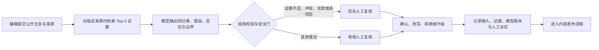

# MedClaim 工作流与产品指标卡

版本：0.1
日期：2026-09-01

## 使用场景与安全边界

MedClaim 面向医学内容编辑和审核人员：输入一条公开医疗主张及其公开来源，系统定位证据、给出四分类判断，并把证据不足、证据冲突或高风险结果优先交给人工复核。

当前原型不是 EHR 集成、临床决策支持或患者端工具；不处理真实患者数据，不自动发布内容，也不提供诊断、处方或个体化治疗建议。

## 工作流



当前所有结果都必须经过人工确认；系统只改变复核优先级，不自动放行。

## 指标定义

所有比例都必须同时报告分子、分母和 95% 置信区间；`gold` 指锁定后、模型不可见且经人工裁决的标准答案。

| 层级 | 指标 | 计算口径 | 用途 |
|---|---|---|---|
| 安全 | 严重漏检率 | 被系统送入普通路径的危险错误病例数 ÷ 全部危险错误 gold 病例数 | 越低越好；发布硬门槛 |
| 安全 | 适当弃答召回率 | 被判为“证据不足”的 gold 证据不足病例数 ÷ 全部 gold 证据不足病例数 | 防止无证据时强答 |
| 质量 | Macro-F1 | 四个标签 F1 的未加权平均值 | 避免多数类掩盖小类失败 |
| 质量 | 人工裁决 Rubric 通过率 | 六维加权分达到 80 且无严重失败的病例数 ÷ 全部已裁决病例数 | 衡量完整性与安全门 |
| 质量 | 引用可支持率 | 证据定位可打开且能支撑最终判断的病例数 ÷ 全部已完成病例数 | 衡量可复核性，不等同于标签正确率 |
| 人机协作 | 人工改判率 | 人工最终标签不同于模型初始标签的病例数 ÷ 全部人工复核病例数 | 识别模型与规则薄弱处；不是单纯追求越低 |
| 人机协作 | 人工升级率 | 交医学专家处理的病例数 ÷ 全部人工复核病例数 | 监控风险与工作量，需按原因分层 |
| 人机协作 | 自动放行覆盖率 | 无人工确认直接进入发布流程的病例数 ÷ 全部病例数 | 当前固定为 0；仅在安全门经前瞻性验证后讨论 |
| 效率 | 复核时长 | 从打开病例到提交最终决定的中位数与 P90 | 与纯人工同任务比较 |
| 效率 | 节省时长 | （纯人工中位时长 − AI 辅助中位时长）÷ 纯人工中位时长 | 只在随机、同口径计时后报告 |
| 运行 | 无效结构化输出率 | 未通过 JSON/字段校验的输出数 ÷ 全部模型调用数 | 监控管线可靠性 |
| 运行 | 检索无命中率 | Top-3 未包含 gold 证据的可评病例数 ÷ 全部可评检索病例数 | 区分检索失败与推理失败 |
| 运行 | 延迟与成本 | 每例端到端 P50/P95 秒数及模型费用 | 固定模型、接口和计费版本后才可比较 |

## 当前已测结果

这些数字来自公开资料构成的小型离线实验，不是临床性能：

- 检索：两个 holdout 共 18 个可评病例，Top-1 命中 18/18；语料是人工整理且按来源 URL 过滤，不能外推到开放网络。
- 三次独立运行、每次同一 20 条 holdout：无检索/RAG 平均 Accuracy 为 80.0%/81.7%，Macro-F1 为 0.7769/0.7915。差异不稳定，不能声称 RAG 提高分类正确率。
- 主评分者记录的平均 Rubric 通过率为 73.3%/81.7%，120 个模型回答中严重失败记录为 0；独立 AI 预复核显示人群/线别评分口径敏感，最终结果仍需第二名人类评分者确认。
- 尚未做计时实验，因此不能声称节省审核时间、降低成本或达到临床部署水平。

## 前瞻性目标（不是当前结果）

下一轮人机协作实验预先锁定以下门槛：

- 严重漏检率为 0；出现 1 例即停止自动化扩展并复盘安全门。
- 无效结构化输出率为 0。
- 引用可支持率不低于 95%。
- 人工裁决 Rubric 通过率不低于 80%。
- 在严重漏检率不恶化的前提下，AI 辅助复核中位时长较纯人工缩短至少 25%。

## 20 例计时实验

使用同一组 20 条公开资料病例，采用平衡的 AB/BA 顺序：一半先纯人工后 AI 辅助，另一半顺序相反；同一病例两次复核间隔至少 7 天。记录：

```text
case_id,reviewer_id,condition,sequence,started_at,finished_at,
initial_label,model_label,final_label,override,escalated,critical_miss,notes
```

分析时报告每种条件的样本量、中位数、P90、改判率、升级率和严重漏检分子/分母。20 例只能发现明显流程问题；学习效应、单一审核者偏差和宽置信区间必须随结果披露。

## 发布决策

- **可继续试点：** 严重漏检为 0，结构输出有效，引用可支持率和 Rubric 通过率达标，并观察到预注册的计时改善。
- **只保留辅助证据定位：** 安全达标但标签质量或效率未达标。
- **停止扩展：** 出现严重漏检、来源不可追溯、真实患者数据进入流程，或人工复核无法稳定裁决。

可以声称：完成了公开资料上的可复现评测、检索和人机审核流程设计。

不能声称：已验证临床有效性、可以替代医学专家、能够自动发布，或已经节省审核时间。
